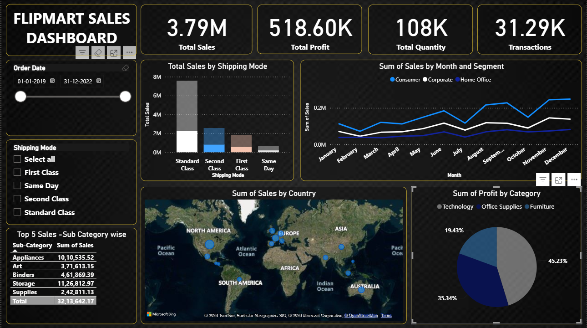

# 📊 Flipmart Sales Dashboard

## 📌 Project Overview

Flipmart Sales Dashboard is an interactive business intelligence dashboard developed using *Microsoft Power BI*.

The dashboard analyzes sales performance, profitability, quantity, transactions, shipping modes, customer segments, countries, and product categories.

## 🛠️ Tools & Technologies

- Microsoft Power BI
- Power Query
- DAX
- Data Cleaning
- Data Visualization
- Business Intelligence

## 📈 Key Performance Indicators

| Metric | Value |
|---|---:|
| Total Sales | 3.79M |
| Total Profit | 518.60K |
| Total Quantity | 108K |
| Transactions | 31.29K |

## 📊 Dashboard Features

- Sales analysis by shipping mode
- Monthly sales analysis by customer segment
- Sales analysis by country
- Profit analysis by category
- Top 5 sales sub-categories
- Order date filtering
- Shipping mode filtering
- Interactive Power BI visualizations

## 🖼️ Dashboard Preview

## 📂 Project Files

- Powerbi(project).pbix – Power BI dashboard project
- dashboard.png – Dashboard preview image

## 🎯 Project Objective

The objective of this project is to transform sales data into an interactive dashboard that makes it easier to understand business performance and identify important sales and profitability trends.

## 👨‍💻 Skills Demonstrated

- Data Analysis
- Data Visualization
- Power BI
- Power Query
- DAX
- Business Intelligence
